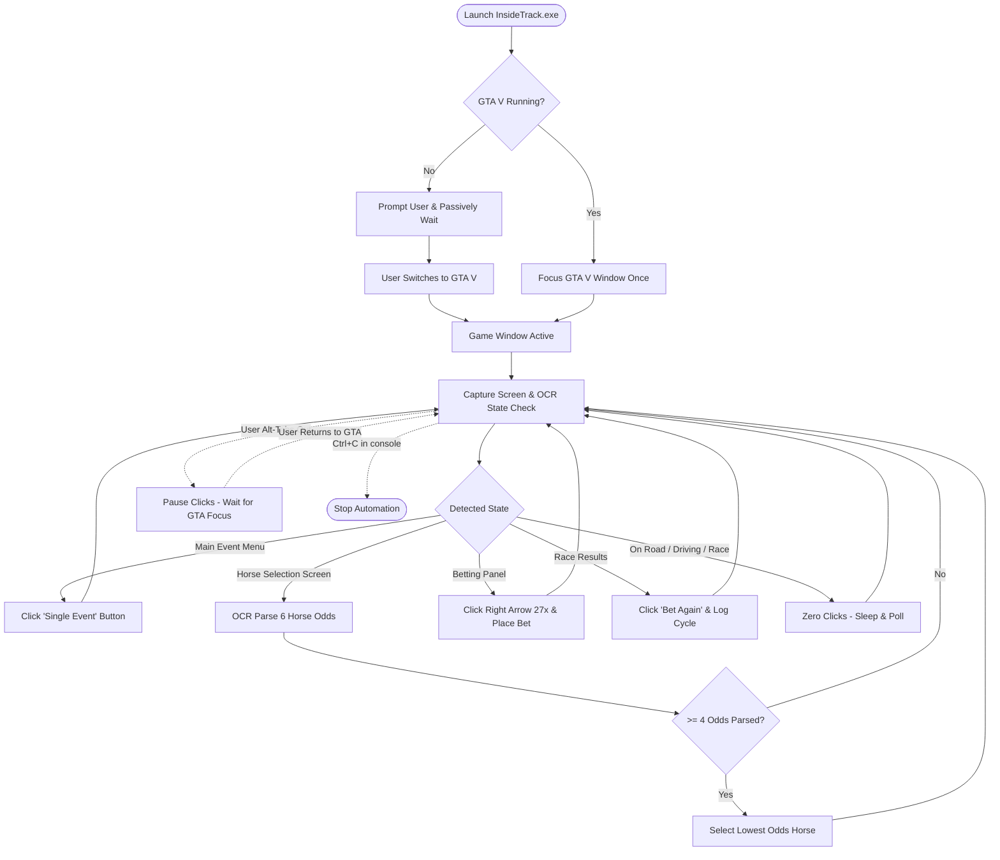

# InsideTrack-GTA5

[](https://microsoft.com/windows)
[-brightgreen)](https://github.com/nitishdhamu/InsideTrack-GTA5/releases/latest)
[](#how-it-works)
[](https://www.python.org/)

An intelligent, non-intrusive screen automation utility for Diamond Casino & Resort Inside Track horse racing in Grand Theft Auto Online.

InsideTrack-GTA5 operates strictly through external computer vision and simulated user input. It captures desktop frames, parses the live betting roster using Optical Character Recognition (OCR), selects the runner with the highest statistical win probability (lowest odds), maximizes the bet, and repeats the betting loop automatically.

---

> [!IMPORTANT]
> **External Vision Only / Zero Memory Injection**
> This utility does not hook into game processes, inject DLLs, alter game files, read memory, or intercept network traffic. It interfaces with the game exclusively through standard Windows desktop screen capture and virtual mouse input. Automating gameplay may be subject to Rockstar Games Terms of Service; use responsibly and at your own discretion.

---

## Download

**[Download InsideTrack.exe (Latest Release)](https://github.com/nitishdhamu/InsideTrack-GTA5/releases/latest)** *(Standalone Windows 64-bit Executable)*

The precompiled executable is completely self-contained. No Python runtime, compilers, or package managers are required to run it.

---

## Quick Start

### 1. Install Tesseract OCR (One-Time Setup)
The vision engine requires Tesseract OCR to read text and odds from the betting terminal. If not already installed, install it via Windows Package Manager:

```cmd
winget install -e --id UB-Mannheim.TesseractOCR --accept-source-agreements --accept-package-agreements
```

Alternatively, download the installer directly from the [UB-Mannheim/tesseract repository](https://github.com/UB-Mannheim/tesseract/wiki).

### 2. Configure GTA V Graphics Settings
To ensure consistent screen coordinate alignment and OCR accuracy, configure these settings in GTA Online:

| Setting | Recommended Value | Reason |
| :--- | :--- | :--- |
| **Display Type** | `Windowed Borderless` | Preserves standard pixel coordinates across window focus changes |
| **Resolution** | `1920 x 1080` | Native calibrated resolution for screen bounding boxes |
| **Pause Game On Focus Loss** | `Off` | Prevents the game engine from pausing when backgrounded |

### 3. Run the Bot
1. Download `InsideTrack.exe` from the [Releases page](https://github.com/nitishdhamu/InsideTrack-GTA5/releases/latest) into any folder.
2. Launch GTA Online, go to the Diamond Casino Inside Track room, and sit down at any betting computer.
3. Run `InsideTrack.exe`.
4. The bot will detect the betting terminal and execute race cycles automatically.

> [!TIP]
> **Custom Configuration**: By default, the bot runs using built-in settings. If you want to customize timing delays or coordinates, place a `config.json` in the same directory as `InsideTrack.exe`. The executable automatically detects and loads it.

---

## How It Works



---

## Core Features & Safety Architecture

### 1. Statistical Lowest-Odds Betting Engine
Inside Track displays 6 runners with fractional odds (e.g. `Evens`, `2/1`, `3/1`, `5/1`, `14/1`, `28/1`). Lower fractional odds denote higher win probabilities:
- The bot extracts all 6 odds entries using OCR.
- It calculates the implied probability of each runner.
- It targets and selects the favorite runner with the lowest odds.

### 2. Smart Window Management & Non-Intrusive Detection
- **Single Focus Attempt**: On startup, the bot attempts to bring Grand Theft Auto V to the foreground once if it is already running.
- **Passive Active-Window Monitoring**: If GTA V is not active, the bot never repeatedly steals focus. It checks every 2 seconds without disrupting other applications.
- **Foreground Focus Shield**: If you Alt-Tab away from GTA V, mouse movement and clicking immediately pause until GTA V returns to the active foreground.

### 3. Open-World & On-Road Safe (Zero-Click Invariant)
Walking around Los Santos, driving vehicles, or playing missions will never trigger unintended clicks:
- State classification enforces multi-keyword verification across distinct screen regions.
- Outside the casino betting terminal, the state evaluates as `race_or_unknown`, in which zero mouse movements and zero clicks occur.
- Horse selection requires reading at least 4 valid fractional odds before any click is dispatched.

### 4. Clean Console Shutdown
- Stop the bot at any time by pressing <kbd>Ctrl</kbd> + <kbd>C</kbd> in the console window, or simply by closing the console window.
- No background keyboard hooks or hotkeys are required.

### 5. Pure Lightweight Vision Engine
- Uses pure Pillow (PIL) image processing instead of OpenCV or NumPy.
- Keeps executable size compact (~15.8 MB) with minimal RAM and CPU utilization.

---

## Command-Line Arguments

When executed via PowerShell or Command Prompt, `InsideTrack.exe` supports optional parameters:

```text
usage: InsideTrack.exe [-h] [--config CONFIG] [--dry-run] [--once]
                       [--start-delay START_DELAY]
                       [--bet-right-clicks BET_RIGHT_CLICKS]
                       [--click-hold-seconds CLICK_HOLD_SECONDS]
```

| Parameter | Type | Default | Description |
| :--- | :--- | :--- | :--- |
| `--dry-run` | Flag | `False` | Simulates all screen detection and planned clicks without sending mouse inputs. |
| `--once` | Flag | `False` | Executes a single betting cycle and exits immediately. |
| `--config <path>` | String | `./config.json` | Path to a custom configuration JSON file. |
| `--bet-right-clicks <N>` | Integer | `27` | Number of right-arrow clicks on bet amount (27 clicks = $10,000 maximum bet). |
| `--start-delay <sec>` | Float | `0` | Delay in seconds before starting automation once GTA is active. |
| `--click-hold-seconds <sec>` | Float | `0.12` | Duration in seconds the mouse button is held down per click. |

---

## Configuration Reference (`config.json`)

To customize settings, place `config.json` in the same directory as `InsideTrack.exe`:

```json
{
  "screen_width": 1920,
  "screen_height": 1080,
  "poll_delay_seconds": 0.8,
  "race_poll_delay_seconds": 3.0,
  "post_click_delay_seconds": 1.2,
  "click_hold_seconds": 0.12,
  "post_move_delay_seconds": 0.05,
  "bet_right_click_interval_seconds": 0.15,
  "bet_right_clicks": 27,
  "ocr_min_rows_required": 4,
  "clicks": {
    "main_single_event_place_bet": [1455, 845],
    "betting_place_bet": [1280, 790],
    "result_bet_again": [960, 998],
    "horse_rows": [
      [335, 338],
      [335, 459],
      [335, 580],
      [335, 702],
      [335, 823],
      [335, 944]
    ],
    "bet_amount_right": [1518, 517]
  },
  "regions": {
    "state_top": [720, 20, 760, 180],
    "state_right": [960, 175, 670, 790],
    "state_betting_panel": [990, 380, 580, 340],
    "state_bottom": [150, 760, 1620, 290],
    "odds_rows": [
      [175, 345, 150, 46],
      [175, 466, 150, 46],
      [175, 587, 150, 46],
      [175, 709, 150, 46],
      [175, 830, 150, 46],
      [175, 951, 150, 46]
    ]
  },
  "tesseract_cmd": ""
}
```

### Parameter Reference

| Parameter | Type | Default | Description |
| :--- | :--- | :--- | :--- |
| `screen_width`, `screen_height` | Integer | `1920`, `1080` | Target screen resolution. |
| `poll_delay_seconds` | Float | `0.8` | Interval between screen capture loops during menu navigation. |
| `race_poll_delay_seconds` | Float | `3.0` | Polling interval during active race playback. |
| `post_click_delay_seconds` | Float | `1.2` | Cooldown period after placing a bet or entering menus. |
| `click_hold_seconds` | Float | `0.12` | Duration mouse left click is held down. |
| `post_move_delay_seconds` | Float | `0.05` | Delay after mouse repositioning before clicking. |
| `bet_right_click_interval_seconds` | Float | `0.15` | Delay between consecutive right-arrow clicks to increment bet amount. |
| `bet_right_clicks` | Integer | `27` | Total clicks on bet amount right-arrow (27 clicks = $10,000 max bet). |
| `ocr_min_rows_required` | Integer | `4` | Minimum valid odds rows required before confirming horse selection screen. |
| `clicks` | Object | Coordinates | `[X, Y]` click locations calibrated for 1080p. |
| `regions` | Object | Coordinates | `[X, Y, W, H]` bounding boxes for OCR text detection. |
| `tesseract_cmd` | String | `""` | Optional manual path to `tesseract.exe` if not detected automatically. |

---

## Developer Guide: Running from Source

To run from source or build the standalone executable:

### 1. Clone & Run with Python
```cmd
git clone https://github.com/nitishdhamu/InsideTrack-GTA5.git
cd InsideTrack-GTA5
pip install pillow mss pydirectinput pytesseract
python bot.py
```

### 2. Compile Standalone Executable
To compile `InsideTrack.exe` using the automated build script:
```cmd
build.bat
```
The build script:
1. Creates an isolated virtual environment (`.build_env`).
2. Installs required build dependencies (`PyInstaller`, `pillow`, `mss`, `pydirectinput`, `pytesseract`).
3. Compiles `bot.py` into `dist\InsideTrack.exe` (~15.8 MB).
4. Cleans up temporary build files and virtual environments automatically.

---

## Project Structure

```text
InsideTrack-GTA5/
├── bot.py          # Vision detection engine, OCR logic, and automation loop
├── config.json     # Screen coordinates, OCR regions, and timing parameters
├── build.bat       # Automated PyInstaller build script for compiling InsideTrack.exe
├── .gitignore      # Git ignore patterns for build caches and binaries
└── README.md       # Technical documentation and user guide
```
